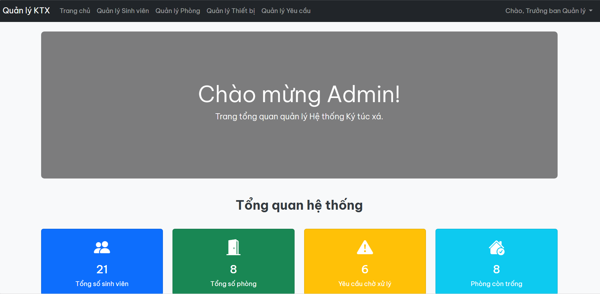
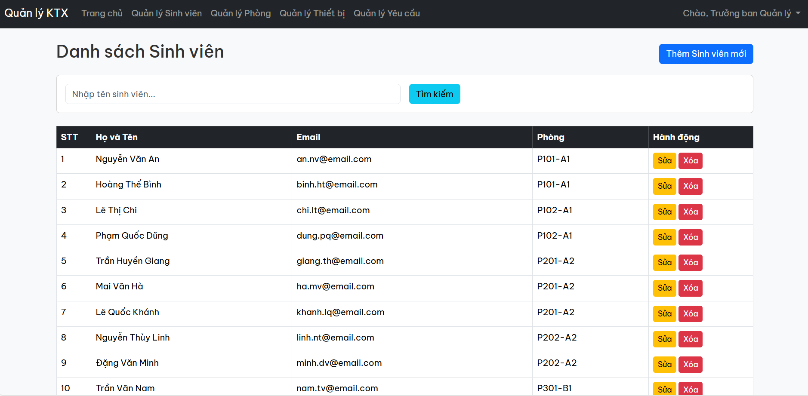
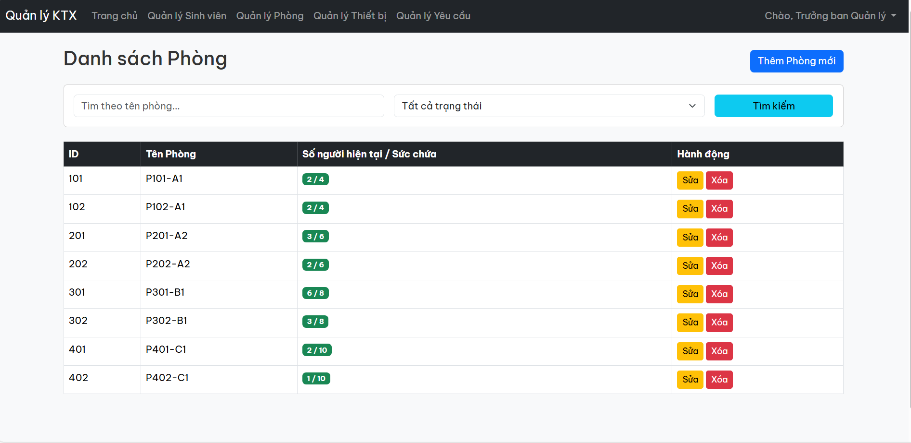
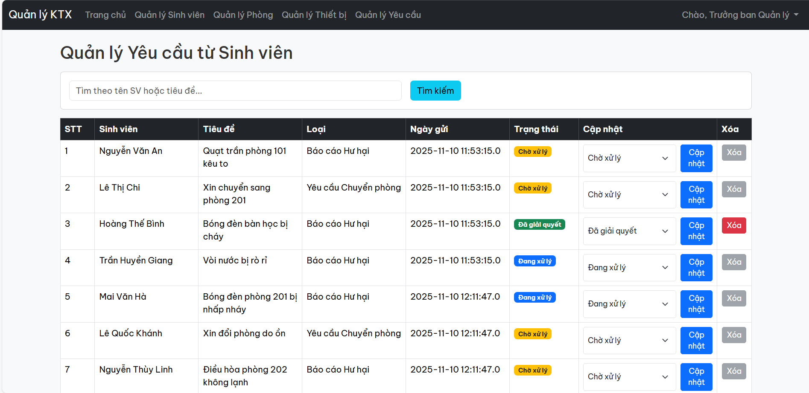
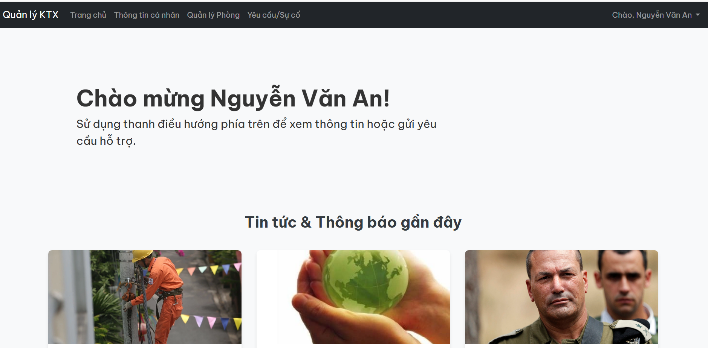
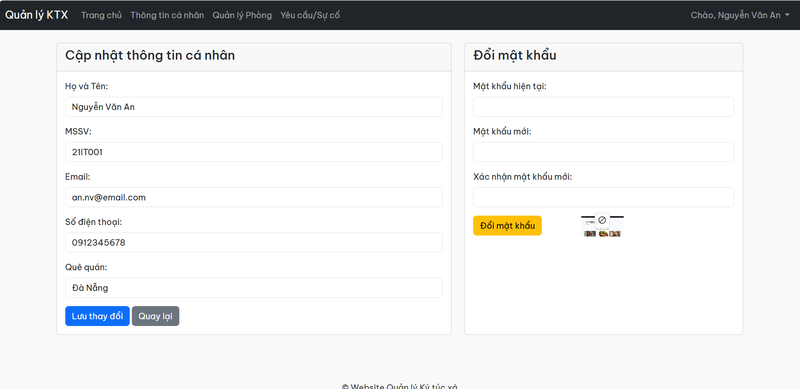
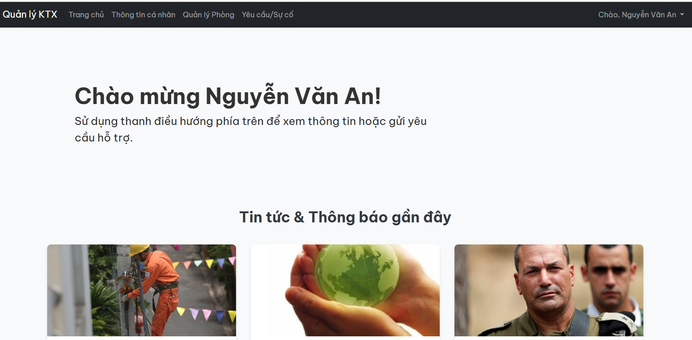

# Dormitory Management System

A web-based application built with Java JSP/Servlet, Maven, and MySQL. This system provides a centralized platform for administrators and students to efficiently manage room information, facilities, and incident reports.

## 🛠️ Tech Stack
*   **Language:** Java
*   **Backend:** Java Servlets
*   **Frontend:** JavaServer Pages (JSP), HTML, CSS
*   **Database:** MySQL
*   **Build Tool:** Apache Maven
*   **Web Server:** Apache Tomcat

## ✨ Core Features

| Feature | Description | Screenshot |
| :--- | :--- | :---: |
| **Admin Dashboard** | A comprehensive overview for administrators, displaying key statistics and providing quick navigation to major management functions. |  |
| **Student Management** | (Admin-only) Allows admins to view a list of all students, search for specific users, add new students, update their information, and remove student accounts. |  |
| **Room Management** | (Admin-only) Provides tools to add, edit, and delete room information. Admins can also view room details, including assigned students and a list of devices/facilities. |  |
| **Issue Management** | (Admin-only) Displays a list of all issues reported by students. Admins can view report details and update the status (e.g., "Received," "In Progress," "Resolved"). |  |
| **Student Dashboard** | The main landing page for students, showing their personal profile, current room details, and access to student-specific functions. |  |
| **Profile Management** | (For Students) Allows students to view and update their personal information, such as phone number, email, and contact address. |  |
| **Issue Reporting** | (For Students) A dedicated form for students to submit reports about problems in their rooms, such as broken equipment, utility issues, or maintenance requests. |  |

## 🚀 Installation & Setup Guide

Follow these command-line instructions to set up the project.

### **Step 1: Clone the Repository**
Open your terminal and run the following commands:
```bash
# Clone the project from GitHub
git clone <YOUR_GIT_REPOSITORY_URL>

# Navigate into the project directory
cd DormitoryManagement
```

### **Step 2: Set Up the MySQL Database**
You can use a GUI tool or the command line. The following commands are for the command-line interface.

```bash
# Log in to MySQL as the root user (or another user with privileges)
mysql -u root -p

# Once logged in, create the new database
CREATE DATABASE dormitory_management;

# Exit the MySQL prompt
exit;

# Import the SQL script to create tables and data.
# This command runs from your standard terminal, not the MySQL prompt.
# Replace 'root' with your MySQL username if different.
mysql -u root -p dormitory_management < dormitory_management.sql
```
**Note:** After importing, double-check the database connection settings (URL, username, password) in the project's source code (e.g., in a `DBContext.java` or `db.properties` file) to ensure they match your local setup.

### **Step 3: Build the Project with Maven**
This command will compile the code and package it into a `.war` file.
```bash
# Ensure you are in the project's root directory (with pom.xml)
mvn clean install
```
After completion, you will find `DormitoryManagement.war` inside the `/target` directory.

### **Step 4: Deploy to Apache Tomcat**
These commands assume you have a `CATALINA_HOME` environment variable pointing to your Tomcat installation directory.

**For Windows (Command Prompt):**
```bash
# Copy the .war file to Tomcat's webapps directory
copy target\DormitoryManagement.war %CATALINA_HOME%\webapps\
```

**For macOS / Linux:**
```bash
# Copy the .war file to Tomcat's webapps directory
cp target/DormitoryManagement.war $CATALINA_HOME/webapps/
```

### **Step 5: Start and Stop the Tomcat Server**

**For Windows:**
```bash
# Start the server
%CATALINA_HOME%\bin\startup.bat

# To stop the server later
%CATALINA_HOME%\bin\shutdown.bat
```

**For macOS / Linux:**
```bash
# Start the server
$CATALINA_HOME/bin/startup.sh

# To stop the server later
$CATALINA_HOME/bin/shutdown.sh
```
Wait a few moments for the server to start and deploy the application.

### **Step 6: Access the Application**
Open your favorite web browser and navigate to the following URL:
[http://localhost:8080/DormitoryManagement/](http://localhost:8080/DormitoryManagement/)

---